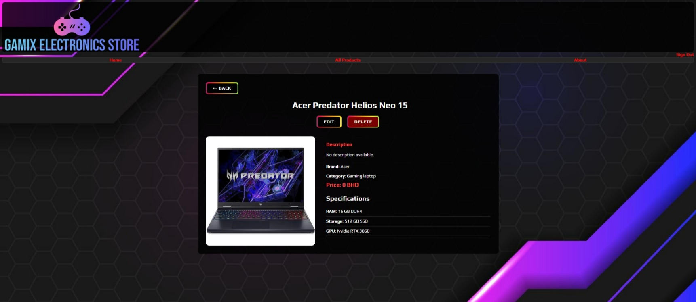
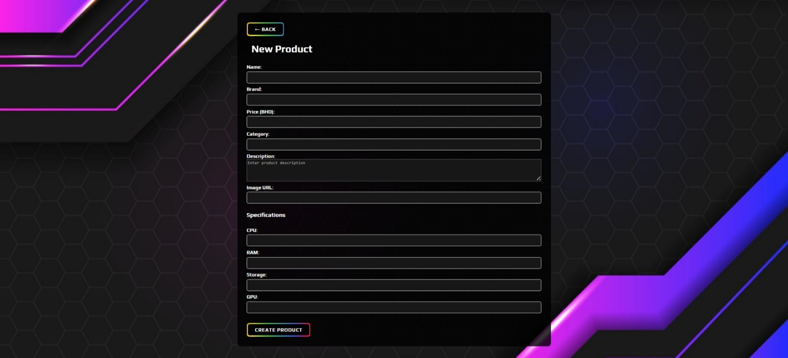
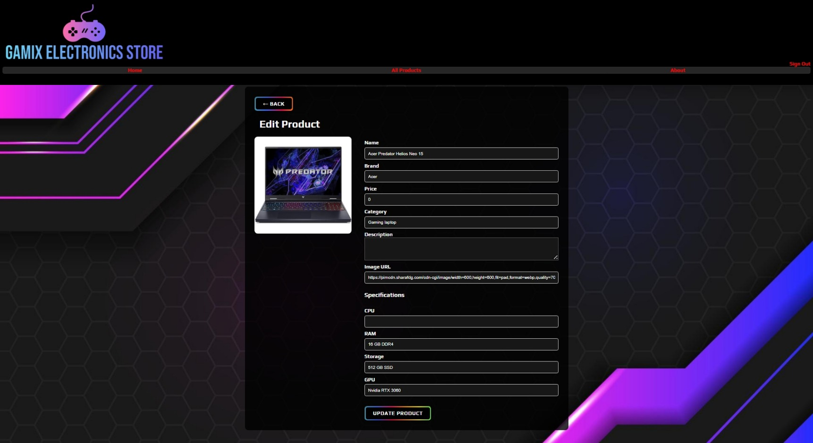

# Gamix Electronics

## Description
Gamix Electronics is a web application built using the MEN stack (MongoDB, Express.js, Node.js) with EJS templating.  
The app allows users to **browse, create, edit, and delete electronic products** such as laptops and gaming devices.  
Each product is linked to the user who created it, ensuring secure, personalized content management.

The application features session-based authentication, enabling users to **sign up, log in, and manage their own products**. The UI is styled with a cohesive dark theme, with Flexbox and Grid used for responsive layouts.

---

## Features
- User authentication (Sign Up / Sign In / Sign Out)
- Full CRUD operations for products:
  - Create: Add a new product with specifications (CPU, RAM, Storage, GPU)
  - Read: View all products and detailed product pages
  - Update: Edit product information (accessible only by creator)
  - Delete: Remove products (accessible only by creator)
- Responsive design with styled buttons and forms
- Image previews for products
- Searchable product listing (future enhancement possible)

---

## Screenshots

### Home Page

### Product Details Page

### Add Product Page

### Edit Product Page

---

## Getting Started

You can access the deployed app here: [Gamix Electronics Store Live](https://gamixelectronicsstore.onrender.com/)

## Technology Used

- JavaScript – core language

- Node.js – server-side runtime

- .js – backend framework

- MongoDB – database

- Mongoose – MongoDB ORM

- EJS – templating engine

- Express-session & connect-mongo – session management

- CSS Grid & Flexbox – layout and responsive design

## Future Improvements / Stretch Goals

- Implement product search and filtering

- Allow multiple images per product

- Add user profile pages

- Improve UI with more animations and hover effects

- Implement ratings and reviews for products

- Implement checkout page to allow user to add the product to their cart and proceed to checkout page

## Author

[Ahmed](https://github.com/AhmedJ8000/)

This project is my MEN Stack CRUD App, fulfilling technical, UI/UX, and GitHub requirements.